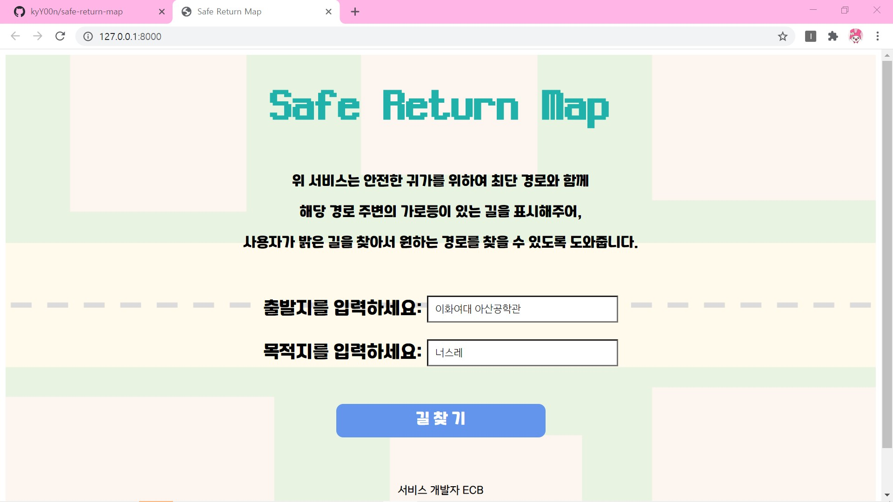
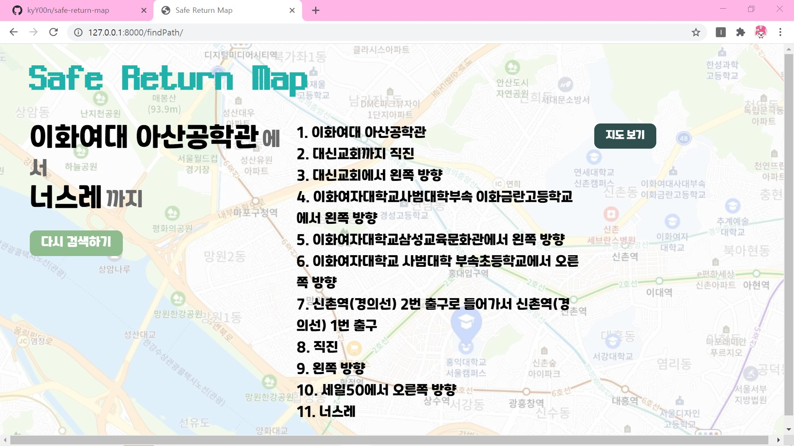
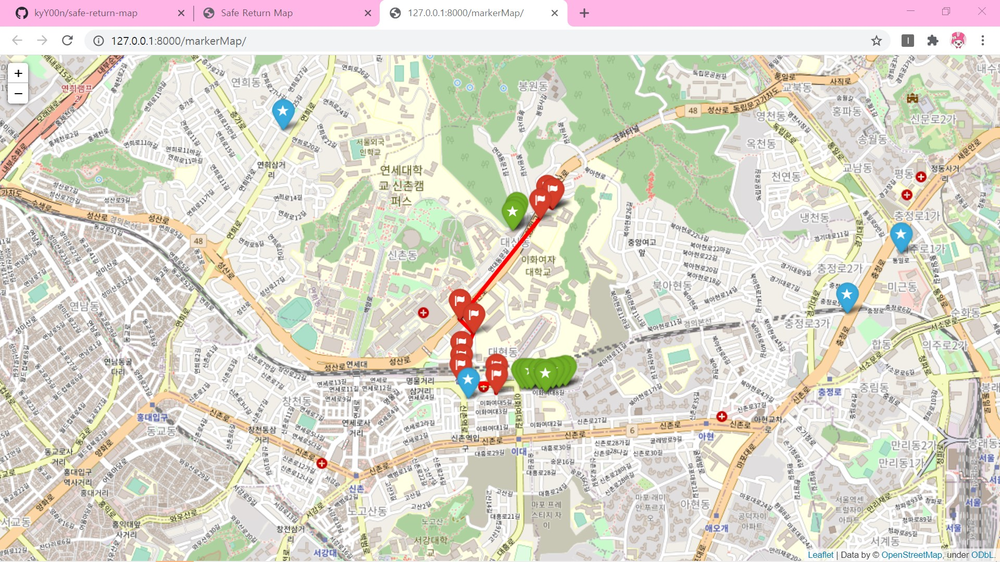

# Safe-return-map

## 소개
**서대문구 밝은 길 안내 서비스**   
: 가로등, 경찰서 위치 공공 데이터 활용 서대문구 도보 경로 제공 서비스   

## 개발자 정보
팀명: **ECB**   
**김서현**(@kshjessica) - kshjessica   
**김윤서**(@yoonseo-hi) - Yoonseo KIM   
**윤가영**(@kyY00n) - Kayoung Yoon    
**한근영**(@syi07030) - syi07030   

-----
## 서비스 미리보기

- 시작 화면
  

- 경로 출력화면
  

- 지도 출력 화면 ( 파란색 : 파출소, 초록색: 가로등, 빨간색: 최단경로)
  

## 핵심 아이디어 소개

### 1. 소프트웨어의 목적
뉴스나 기사를 보면 밤에 혼자 길을 가는 사람들을 대상으로 한 범죄, 이른바 **‘귀갓길 범죄’** 에 대한 내용을 흔치 않게 볼 수 있다.  
밤길 불안감을 줄이기 위한 방법에는 어떤 것이 있을까? 우리는 **가로등**과 **보안용 CCTV**라는 안전 장치에 주목했다. 일반적으로 사람들은 어두운 길을 다니는 것을 두렵게 느끼며 범죄는 CCTV가 없는 길에서 발생하는 경우가 많기 때문에 이가 없을 경우 더욱 큰 불안감을 느낀다. 사람들은 안전하지 못한 길을 다닐 때 불안감을 느끼기 때문에 골목길을 통한 이동이 빠르더라도 안전하게 느껴지는 큰길 등을 통해 집으로 돌아가기를 선호하는 경향이 있다. 우리는, 이것이 안전하고 빠른 길이 있지만 그 경로를 모르기 때문에 당장 눈 앞에 보이는 안전한 길을 택하여 돌아가는 것이라고 생각했다. 즉, 대부분은 안심하고 걸을 수 있으면서 빠른 길들이 어디에 위치하며, 그러한 길을 통해서 도착지까지 가는 경로를 알지 못하기 때문에 밤길 불안감을 항상 가지면서도 이전과 같은 경로만으로 다니는 경우가 많다는 것이다.   
목적지까지의 경로를 검색할 때 가로등과 CCTV가 있는 길 위주의 안심 경로 또한 같이 보여주는 서비스가 있으면 사람들이 불안 요소를 해소하는데 큰 도움이 될 수 있겠다고 생각했다. 그래서 밤길 위험 요소가 제거된 안심 경로를 시민들에게 알려줌으로써 사람들이 더 안전한 길로 다닐 수 있도록 돕기 위해 이러한 **안심 귀갓길 서비스 소프트웨어** 를 개발하고자 한다.   

### 2. 주요 기능
본 서비스는 세 가지 길 안내를 포함하는 소프트웨어이다.   
첫 번째, 일반적으로 안내되는 기존의 길 찾기 소프트웨어의 필수적인 기능인 ***최단 경로 안내*** 이다.   
두 번째, 안전과 관련된 기능인 ***큰길 우선 경로 안내*** 이다.   
세 번째, 지원하는 경우가 매우 드문 안전 길 안내인 ***가로등과 CCTV가 위치한 안심 경로 안내*** 이다.   

### 3. 보안 요소
***(1) 데이터 명확성***   
: 공공데이터 사용
***(2) 사용자 위치정보 보호***   
: 사용자 입력 정보 암호화를 통해 개인 위치정보 보호
***(3) 입력 값에 대한 검증(SQL 삽입 공격 방어)***   
: 입력 데이터에 대한 블랙 리스트 필터링 방법

------

## 아이디어 구현 기술 소개

- 개발 언어

언어명 | 목적   
--- | ---   
Python | 소프트웨어 개발   
JavaScript | 웹페이지에 서비스 구현   
SQLite3 | DB 활용   

- 개발 플랫폼 : Django

- 구현 단계   

n | Description  
--- | ---   
1단계 | DB 구축   
2단계 | 웹페이지 구현   
3단계 | 네이버 지도 크롤링을 통한 경로 탐색   
4단계 | DB에서 범위 내 가로등,cctv 정보 선택   
5단계 | folium 라이브러리로 최단경로, 가로등, cctv를 지도에 표시   

*각 단계 별 구체적인 구현 과정은 생략한다.*

------
## 대회 참가 목적

지난 한 학기 동안 현 팀원들과 함께 프로젝트를 진행하며 모임이 잦았다. 네 명이 서로 다른 지역에 멀리 떨어져 살았기 때문에 매번 다른 장소에서 만나야 했다. 때문에 길을 찾아 다닐 일이 많았고 이 과정에서 길 찾기에 세 가지 요소가 필수적이고 중요함을 느꼈다.

첫 번째, **정확한 길 찾기** 다. 코로나 발생으로 경제 순환이 되지 않는 대학가 상권은 많은 변화가 있었다. 가장 큰 변화는 가게가 없어지거나 휴업하는 경우가 많다는 것이다. 그런데 이것이 빠르게 웹 상 반영이 되지 않아 약속 장소에 도착 후 다른 공간을 찾아보는 경우가 종종 있었다. 목적지 도달 도중 다른 곳을 들려 끼니를 해결하는 경우 마찬가지의 상황으로 시간이 허비되는 경우도 있었다. 목적지 외에도 우리가 사용하고자 하는 시설들이 사용 가능한지, 안내된 위지에 있는지 등의 정보가 빠르게 업데이트 되는 것의 중요성을 알 수 있었다.

두 번째, **안전한 길 찾기** 다. 모임이 늦어지는 경우 막차를 타고 각자의 집으로 헤어지는 경우가 많았다. 익숙하지 않아서 지도에 안내된 최단 경로를 따라 집을 가는 경우 골목길 등 인적이 드문 길로 안내되는 경우가 있었다. 혹은 익숙하지만 밤이 늦어 스산하게 느껴지는 길을 걷는 경우도 있었다. 그럴 때 우리는 시간이 촉박하지만 큰 길로 가거나 두려움에 서로 통화를 하며 정류장까지 이동했고 귀가하여 도착 여부를 필히 확인했다. 이동 시간대와 장소와 상관없이 안심할 수 있는 길을 찾을 수 있는 방법의 필요성을 알 수 있었다.

세 번째, **효과적인 길 찾기** 다. 길 찾기 앱을 사용하면서 새로 활용하기 시작한 서비스는 다양한 길 안내이다. 최소 환승, 최단 경로, 최소 비용 등 필요한 조건에 따라서 길을 선택할 수 있다. 이들의 이동 시간이 크게 차이나는 경우도 있다. 따라서, 특정 길이 필요하더라도 이동 시간이 크게 차이 날 수 있으므로 선택지가 여러가지 주어진 상태에서 상황에 적절한 경로에 따라 이동해야 할 필요성을 느꼈다.

직접 경험을 통해 정확한, 안전한, 그리고 효과적인 길 찾기가 대학생들이 많이 거주하고 생활하는 지역에 반영되었으면 좋겠다고 생각했다. 따라서, 이번 대회를 통해 세 가지 요소가 다음과 같이 반영된 서대문구 안심 길 찾기 서비스를 구축하려고 한다.

- 정확성: 빠른 데이터 업데이트로 사용자의 원활한 이동과 시설 이용을 보장
- 안전성: 가로등과 보안용 CCTV 공공데이터 활용을 통한 사용자의 안전 보좌
- 효율성: 요소 별 두 가지 이상의 길 안내를 통한 유동적 길 선택 제공

### -
 서비스 개발자 ECB 
 -
